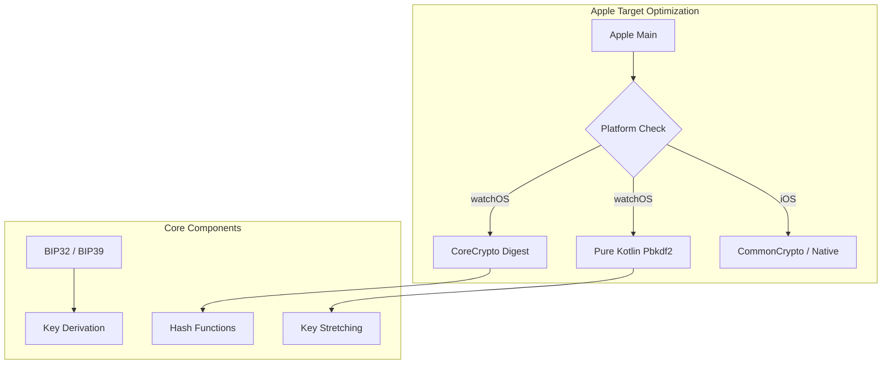

# bitcoin-kmp

> [!IMPORTANT]
> **Fork Information**: This project is forked from [ACINQ/bitcoin-kmp](https://github.com/ACINQ/bitcoin-kmp). It has been modified to support **WatchOS** and **Pure Kotlin Cryptography** for specific platforms.

<p align="center">
  
</p>

<p align="center">
  <a href="https://jitpack.io/#ImL1s/kotlin-bitcoin-kmp"></a>
  <a href="#"></a>
  <a href="#"></a>
  <a href="#"></a>
</p>

<p align="center">
  <strong>₿ Powerful Bitcoin Cryptography library for Kotlin Multiplatform.</strong>
</p>

---

## 🏗️ Architecture



---

## ✨ Features
- **WatchOS Native**: Custom `Digest` and `Pbkdf2` implementations optimized for S-series chips.
- **Full BIP Support**: BIP32, BIP39, BIP44, BIP141 (SegWit).
- **CoreCrypto Integration**: High-performance hashing on Apple platforms via native bindings.
- **Pure Kotlin Fallbacks**: Reliability on platforms with limited native library support.

---

## 📦 Installation

```kotlin
// build.gradle.kts
implementation("com.github.ImL1s:kotlin-bitcoin-kmp:0.14.0-watchos")
```

---

## 📄 License
MIT License
